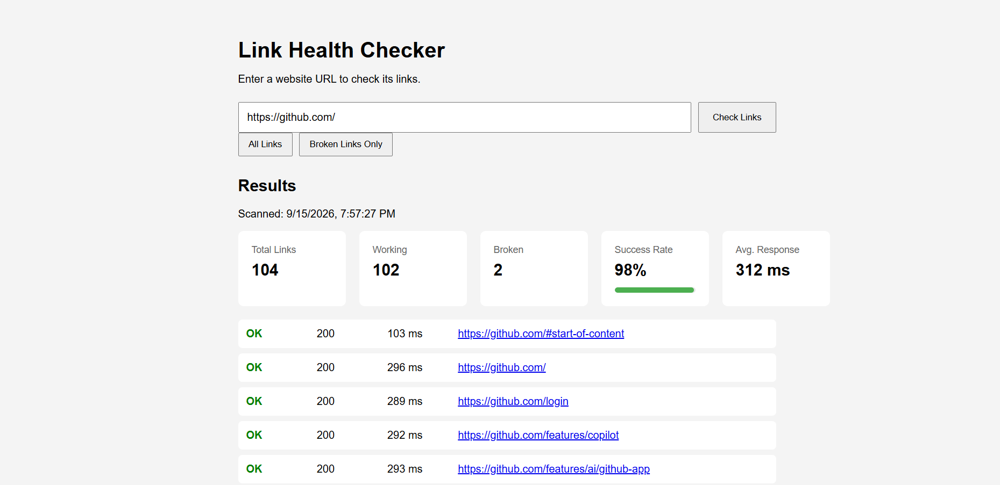

# Link Health Checker

A web-based tool that scans a website, discovers its links, and checks their health.

## Features

* Scans links from a website
* Detects broken links
* Reports HTTP status codes
* Measures response time
* Categorizes responses
* Calculates success rate
* Handles redirects and request failures
* Removes duplicate links
* Provides a simple web dashboard
* Filters results to show broken links only

## Tech Stack

* JavaScript
* Node.js
* Express
* Axios
* Cheerio
* HTML/CSS

## How It Works

1. The user enters a website URL.
2. The Express server receives the request.
3. Axios retrieves the website's HTML.
4. Cheerio extracts its links.
5. Relative URLs are converted into absolute URLs.
6. Duplicate links are removed.
7. Each link is checked using HTTP requests.
8. The results are returned to the dashboard.
9. Users can filter the results to show broken links only.

## Running Locally

Clone the repository and install the dependencies:

```bash
npm install
```

Start the server:

```bash
node server.js
```

Then open:

```text
http://localhost:3000
```

## Project Structure

```text
link-health-checker/
├── services/
│   └── linkChecker.js
├── app.js
├── index.html
├── style.css
├── server.js
├── README.md
├── screenshot.png
├── package.json
└── package-lock.json
```

## Screenshot


